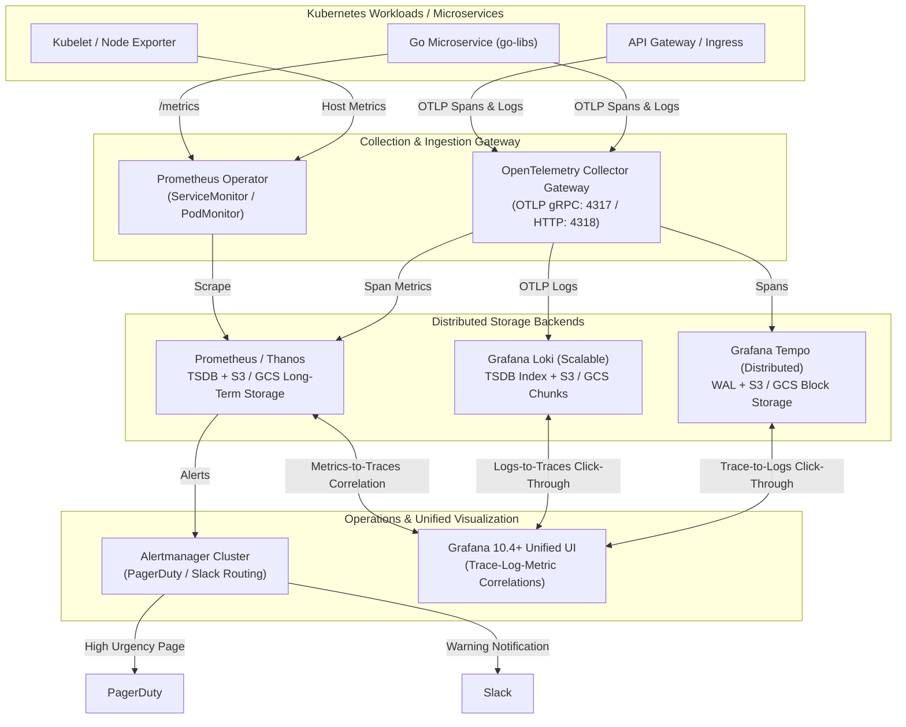

# Enterprise Cloud-Native Observability Architecture

This document specifies the end-to-end architecture of the **Cloud-Native Observability Platform**, built on the **LGTM Stack** (Loki, Grafana, Tempo, Prometheus/Mimir) and **OpenTelemetry (OTel)**.

---

## 1. System Topology & Telemetry Pipelines

---

## 2. Ingestion Protocols & Data Pipelines

### Distributed Traces (OTel -> Tempo)
- **Protocol**: OpenTelemetry Protocol (OTLP) v1 over gRPC (`:4317`) and HTTP (`:4318`).
- **Processing**:
  1. `memory_limiter`: Drops or backpressures if memory utilization exceeds 75%.
  2. `k8sattributes`: Enriches spans with pod name, namespace, UID, and node.
  3. `batch`: Flushes spans in 1024-span batches every 1 second.
- **Storage**: Tempo writes to Write-Ahead Log (WAL) on local SSD, then compacts and flushes immutable blocks to S3/GCS.

### Structured Logs (OpenTelemetry Collector -> Loki)
- **Log Routing**: OpenTelemetry Collector receives OTLP logs via gRPC (`:4317`) and HTTP (`:4318`).
- **Parsing & Enrichment**: Collector pipeline normalizes structured logs, extracts severity, attaches correlation IDs (`trace_id`, `span_id`) as structured metadata, and applies resource attributes (`service.name`, `environment`).
- **Index Architecture**: Loki TSDB index eliminates full-text inverted index bloat, indexing low-cardinality labels (`app`, `service`, `level`) while storing high-cardinality metadata in TSDB object storage with 24h periods.

### Metrics (Prometheus Operator)
- **Pull Model**: Prometheus Operator discovers pods and services via `ServiceMonitor` CRDs.
- **Long-Term Storage**: Thanos sidecar uploads immutable 2-hour TSDB blocks to S3/GCS for indefinite retention.

---

## 3. Unified Cross-Telemetry Correlation

The single greatest differentiator of this platform is **zero-context-switch correlation** in Grafana:

1. **Logs to Traces**:
   When reading a log stream in Loki, any detected `trace_id` regex pattern is rendered as an interactive link. Clicking it opens the exact trace waterfall in Tempo.
2. **Traces to Logs**:
   In Tempo, every span contains a `tracesToLogs` link that queries Loki for all log lines emitted by that container during the span's duration.
3. **Traces to Metrics**:
   Tempo's `serviceMap` automatically computes request rates, error rates, and duration (RED metrics) from spans and overlays them onto Prometheus dashboards.

---

## 4. GitOps Delivery with ArgoCD

All Kubernetes workloads in this repository are managed via the **App-of-Apps pattern**:
- Root application: [`deploy/kubernetes/argocd/app-of-apps.yaml`](deploy/kubernetes/argocd/app-of-apps.yaml)
- Declarative child applications:
  - `kube-prometheus-stack` (Monitoring namespace)
  - `loki-distributed` (Logging namespace)
  - `tempo-distributed` (Tracing namespace)
  - `opentelemetry-collector` (OpenTelemetry namespace)
- **Self-Healing**: Out-of-band drifts are automatically corrected by ArgoCD reconciliation loops.
