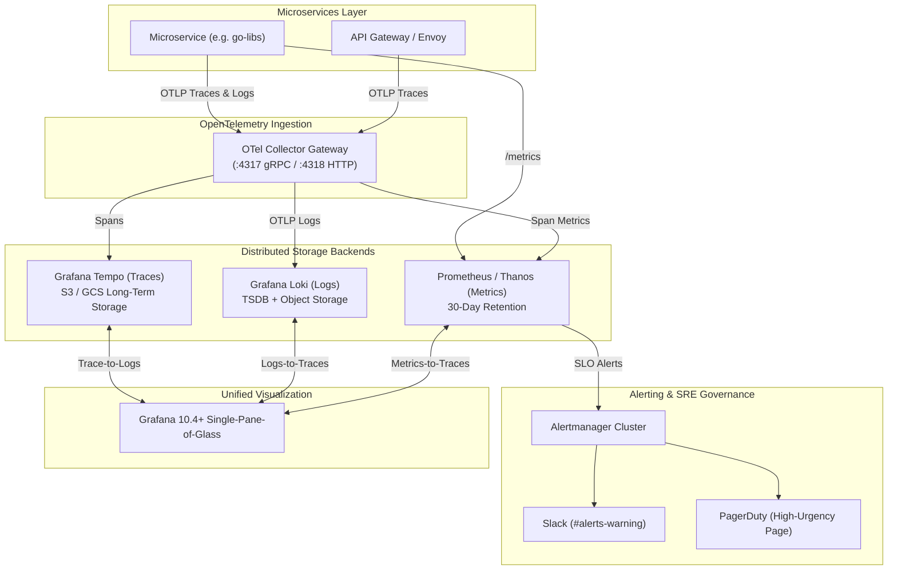

# cloud-native-observability · v0.2.2

> **Note on Repository History**: History reconstructed on 2026-09-11; see [CHANGELOG.md](CHANGELOG.md) for the real feature timeline.

[](https://github.com/Abeta-dev/cloud-native-observability/actions/workflows/ci.yml)
[](LICENSE)
[](https://kubernetes.io)
[](https://prometheus.io)
[](https://grafana.com)
[](https://grafana.com/oss/loki/)
[](https://grafana.com/oss/tempo/)
[](https://opentelemetry.io)
[](https://argo-cd.readthedocs.io)
[](deploy/terraform)

An enterprise-grade, GitOps-ready **Cloud-Native Observability Platform** implementing the modern **LGTM Stack** (Loki, Grafana, Tempo, Prometheus / Thanos) unified with **OpenTelemetry (OTel)**, automated **Google SRE multi-window burn-rate SLO alerting**, production **incident runbooks**, and **trace-to-log cross-telemetry correlation**.

---

## 🏛️ System Architecture



---

## ⚡ 1-Click Local Platform Sandbox

Experience the complete enterprise platform locally on your laptop with zero cloud dependencies:

```bash
# Clone the repository
git clone https://github.com/Abeta-dev/cloud-native-observability.git
cd cloud-native-observability

# Spin up Prometheus, Loki, Tempo, OTel Collector, Grafana, Alertmanager, Demo App, and Traffic Generator
make up
```

### Access Endpoints

| Service | Port | Description | Credentials |
|---|:---:|---|---|
| **Grafana** | [`http://localhost:3000`](http://localhost:3000) | Unified visualization UI with pre-provisioned dashboards | Anonymous (Admin) / `admin:admin` |
| **Prometheus** | [`http://localhost:9090`](http://localhost:9090) | Time-series metrics engine & PromQL console | None |
| **Tempo** | [`http://localhost:3200`](http://localhost:3200) | Distributed trace search and retrieval | None |
| **Loki** | [`http://localhost:3100`](http://localhost:3100) | Log stream query endpoint | None |
| **Alertmanager** | [`http://localhost:9093`](http://localhost:9093) | Alert routing, silencing, and notification dispatcher | None |
| **Demo App** | [`http://localhost:8080`](http://localhost:8080) | Reference microservice emitting RED metrics, spans, and structured logs | None |
| **OTel Collector** | `localhost:4317` (gRPC) / `localhost:4318` (HTTP) | OTLP telemetry ingestion gateway | None |

### Synthetic Traffic Generation
The sandbox automatically runs a continuous traffic generator targeting `demo-app` to populate Prometheus metrics, Loki logs, and Tempo traces upon `make up`. You can also trigger additional bursts manually:
```bash
make traffic
```

---

## 🎯 Pre-Configured Grafana Dashboards

The platform automatically provisions production-grade Grafana dashboards with zero manual import required:

1. **Platform Overview & Telemetry Health** (`platform-overview.json`):
   - Real-time ingestion uptime for Prometheus, Loki, Tempo, and OTel Collector.
   - Global HTTP request throughput (RPS).
   - Ingestion memory footprint across backends.
2. **Microservice APM & Resilience Dashboard** (`microservice-apm.json`):
   - Outbound Circuit Breaker request throughput, failure rates, and state indicator (Closed / Half-Open / Open).
   - Worker pool task velocities (Submitted vs Completed vs Dropped).
   - Cache hit ratio percentages.
3. **Logs Explorer & Error Streams** (`logs-explorer.json`):
   - Centralized container log stream viewer.
   - Real-time error filter isolating 5xx events and stack traces.

---

## 🔗 Cross-Telemetry Correlation (Zero Context Switching)

This platform configures native bidirectional correlation across telemetry types in Grafana:

- **Log to Trace**: Click any highlighted `trace_id` in a Loki log line to immediately jump to the trace in Grafana Tempo.
- **Trace to Log**: Click any span in Tempo to query Loki logs emitted by that exact pod during that span's timeframe.
- **Trace to Metric**: Visualize service dependency graphs and RED metrics derived directly from OTLP trace spans.

---

## 🚨 Google SRE Multiwindow Burn-Rate Alerting

Alerting follows Google's SRE Book (Chapter 5) multi-window multi-burn-rate standard to eliminate alert fatigue while preventing SLA breaches:

| Alert | Short Window | Long Window | Burn Rate | SLA Impact | Action |
|---|:---:|:---:|:---:|:---:|:---:|
| `ServiceErrorBudgetBurnRateHigh1h` | 5m | 1h | **14.4x** | 2% budget consumed in 1 hour | 🚨 **PagerDuty Immediate Page** |
| `ServiceErrorBudgetBurnRateHigh6h` | 30m | 6h | **6.0x** | 5% budget consumed in 6 hours | 🚨 **PagerDuty Immediate Page** |
| `ServiceErrorBudgetBurnRateSlow3d` | 6h | 3d | **1.0x** | 10% budget consumed in 3 days | 📋 **Slack Warning / Jira Ticket** |

Every alert includes a direct `runbook_url` linking to actionable incident response procedures in [`docs/RUNBOOKS.md`](docs/RUNBOOKS.md).

---

## 📊 Prometheus Recording Rules & SLO Error Budget Precomputation

To prevent expensive, ad-hoc PromQL range scans over long windows (1h, 6h, 3d) from exhausting Prometheus TSDB memory and CPU during alert evaluation, precomputed **recording rules** are defined in [`deploy/kubernetes/alerts/slo-alerts.yaml`](deploy/kubernetes/alerts/slo-alerts.yaml) under the `slo.availability.recording` group:

- `job:http_requests:error_rate_5m`: Precomputes 5-minute HTTP 5xx error percentage.
- `job:http_requests:error_rate_30m`: Precomputes 30-minute HTTP 5xx error percentage.
- `job:http_requests:error_rate_1h`: Precomputes 1-hour HTTP 5xx error percentage.
- `job:http_requests:error_rate_6h`: Precomputes 6-hour HTTP 5xx error percentage.
- `job:http_requests:error_rate_3d`: Precomputes 3-day HTTP 5xx error percentage.

### Label Preservation & Alertmanager Routing
All recording rules preserve essential telemetry dimension labels (`service`, `namespace`) using explicit `by (service, namespace)` aggregation clauses. Alert rules then bind operational routing metadata (`severity: critical`, `tier: slo`). This ensures downstream Alertmanager routes (e.g., PagerDuty for critical incidents vs. Slack for warnings) receive complete service metadata and environment context without label stripping, while inhibit rules (`equal: ["alertname", "cluster", "service", "namespace"]`) accurately suppress lower-priority warnings.

---

## 📈 Spanmetrics & Trace-Derived RED Metrics

Distributed traces ingested via OpenTelemetry Collector and Grafana Tempo are automatically synthesized into RED (Rate, Errors, Duration) metrics without requiring application-level metric instrumentation:

1. **Span-to-Metric Synthesis**: The OpenTelemetry pipeline extracts telemetry from raw OTLP spans to generate Prometheus metrics:
   - `traces_spanmetrics_calls_total`: Counter tracking total invocations partitioned by `service.name`, `span.name`, and `status.code`.
   - `traces_spanmetrics_duration_milliseconds_bucket`: Latency histogram capturing duration distributions across configurable buckets (e.g. 2ms to 10s).
2. **Prometheus Scraping & Federation**: Prometheus scrapes these span-derived metrics via the Collector's Prometheus exporter on port `:8889` (`/metrics`), feeding Grafana APM dashboards and service maps directly from distributed traces.

---

## 🗄️ Loki TSDB Indexing & High-Cardinality Protection

Grafana Loki 3.0+ is configured in [`deploy/docker-compose/loki/loki-config.yml`](deploy/docker-compose/loki/loki-config.yml) using the `tsdb` store with a 24-hour index period (`schema: v13`). To avoid catastrophic label cardinality explosions, incoming telemetry is strictly partitioned into indexed labels vs. structured metadata:

| Attribute Type | Configuration | Field Names | Architectural Purpose |
|---|---|---|---|
| **Indexed Stream Labels** | `action: index_label` | `service.name`, `service`, `app`, `deployment.environment`, `environment`, `level` | Low-cardinality streams that partition chunk files in object storage and power fast LogQL stream selectors (`{service="order-svc"}`). |
| **Structured Metadata** | `action: structured_metadata` (`allow_structured_metadata: true`) | `trace_id`, `span_id`, `request_id`, `traceId`, `spanId`, `requestId` | High-cardinality attributes attached to log records without creating distinct streams. Eliminates TSDB index memory bloat while preserving full LogQL filtering and 1-click trace correlation in Grafana. |

---

## 🔔 Golden Signals & Microservice Alerting Rules

In addition to multi-window burn rate alerts, the stack defines production-ready alerting rules for the **4 Golden Signals** and core instance health in [`deploy/docker-compose/prometheus/alerts.yml`](deploy/docker-compose/prometheus/alerts.yml). Aggregation expressions preserve routing labels (`service`, `namespace`, `severity`) via `by (...)` to maintain Alertmanager grouping:

| Alert | Condition / PromQL | Severity | Golden Signal | Action |
|---|---|:---:|:---:|---|
| `ServiceDown` | `up == 0` for 1m | `critical` | Availability | Immediate on-call page via PagerDuty / Slack |
| `HighErrorRate` | `rate(http_requests_total{status=~"5.."}[5m]) / rate(http_requests_total[5m]) > 0.01` for 2m | `critical` | Errors | Page engineer; triage via Loki logs & APM |
| `HighLatencyP99` | `histogram_quantile(0.99, sum(rate(http_request_duration_seconds_bucket[5m])) by (le, service)) > 1.0` for 2m | `warning` | Latency | Slack notification; inspect Tempo distributed traces |
| `WorkerpoolQueueNearFull` | `app_workerpool_queue_depth / app_workerpool_queue_capacity > 0.85` for 2m | `warning` | Saturation | Slack notification; check async worker pool utilization |

---

## ☸️ Production Kubernetes GitOps Deployment

Deploy the entire stack to Kubernetes using the **ArgoCD App-of-Apps** pattern:

```bash
# Deploy the root ArgoCD Application
kubectl apply -f deploy/kubernetes/argocd/app-of-apps.yaml
```

ArgoCD automatically reconciles and manages:
- `kube-prometheus-stack` (Prometheus Operator, Alertmanager, Node Exporter)
- `loki` (Scalable TSDB log storage with S3/GCS)
- `tempo-distributed` (Scalable trace storage with S3/GCS)
- `opentelemetry-collector` (DaemonSet with `k8sattributes` processor)

Cloud provider overlay templates are available in [`deploy/kubernetes/examples/overlays/`](deploy/kubernetes/examples/overlays/) for AWS EKS (`values-eks.yaml` with gp3 & IRSA) and GCP GKE (`values-gke.yaml` with Workload Identity).

---

## 🏗️ Observability as Code (Terraform & OpenTofu)

Manage telemetry infrastructure, long-term cloud storage, and Grafana configurations declaratively via [deploy/terraform](deploy/terraform):

| Pillar | When to Use | Where to Use | Why Terraform |
|---|---|---|---|
| **Cloud Storage** | Long-term trace & log retention | AWS S3 / GCS / Azure Blob | Enforces AES-256 SSE encryption, public access block, and automated lifecycle migration to Infrequent Access. |
| **Workloads** | Kubernetes monitoring provisioning | AWS EKS / GCP GKE / Minikube | Orchestrates `kube-prometheus-stack`, `tempo`, and `loki` Helm releases via declarative state. |
| **OaC (Dashboards & Alerts)** | Multi-environment promotion | Grafana Cloud / Self-hosted Grafana | Eliminates ClickOps drift; peer-reviews P1/P2 alert rules, SLO thresholds, and PagerDuty/Slack routing via Git PRs. |

```bash
cd deploy/terraform
cp terraform.tfvars.example terraform.tfvars
terraform init
terraform plan
terraform apply
```

Read the full [Terraform Observability Guide](docs/TERRAFORM_GUIDE.md) for architectural trade-offs, drift detection, and secrets management.

---

## 📁 Repository Structure

```
.
├── .github/workflows/ci.yml         # CI workflow validating configs and alerts
├── ARCHITECTURE.md                  # Detailed architectural specification
├── Makefile                         # Platform automation (up, down, traffic, lint)
├── deploy/
│   ├── docker-compose/              # Local multi-service platform sandbox
│   │   ├── docker-compose.yml       # Prometheus + Loki + Tempo + OTel + Grafana
│   │   ├── grafana/                 # Datasources & dashboards provisioning
│   │   ├── loki/                    # Loki TSDB configuration
│   │   ├── otel-collector/          # OTLP pipeline gateway configuration
│   │   ├── prometheus/              # Scrape jobs & Golden Signals alerts (alerts.yml)
│   │   ├── tempo/                   # Distributed tracing configuration
│   │   └── traffic-generator/       # Synthetic microservice traffic simulator
│   ├── kubernetes/                  # Production GitOps infrastructure
│   │   ├── alerts/                  # Alertmanager & Google SRE PrometheusRules
│   │   ├── argocd/                  # ArgoCD App-of-Apps declarations
│   │   ├── examples/overlays/       # Cloud provider overlay templates (EKS/GKE)
│   │   └── helm/                    # Base values for core stack
│   └── terraform/                   # Observability as Code (Storage, Helm, Grafana OaC)
│       ├── main.tf                  # Root multi-tier composition
│       ├── modules/                 # Storage, Kubernetes, and Grafana modules
│       └── README.md                # Decision framework & deployment runbook
└── docs/
    ├── INTEGRATION_GUIDE.md         # Microservice connection tutorial (go-libs)
    ├── RUNBOOKS.md                  # SRE incident response runbooks
    ├── SAMPLING_STRATEGIES.md       # OpenTelemetry trace sampling strategies guide
    ├── SLO_DESIGN.md                # Mathematical error budget calculation guide
    └── TERRAFORM_GUIDE.md           # Observability as Code architecture & drift runbook
```

---

## 🤝 Integration with `go-libs`

Microservices built on [`github.com/Abeta-dev/go-libs`](https://github.com/Abeta-dev/go-libs) connect natively:
1. **Metrics**: Scraped automatically via `ServiceMonitor` on `/metrics`.
2. **APM & Traces**: Exported via `go-libs/apm` to OTel Collector on port `4317`.
3. **Logs**: Structured JSON with `trace_id` fields auto-correlated in Grafana.

See the full [Integration Guide](docs/INTEGRATION_GUIDE.md) for copy-paste recipes.

---

## 📄 License

MIT License. Copyright (c) 2026 Abeta.
