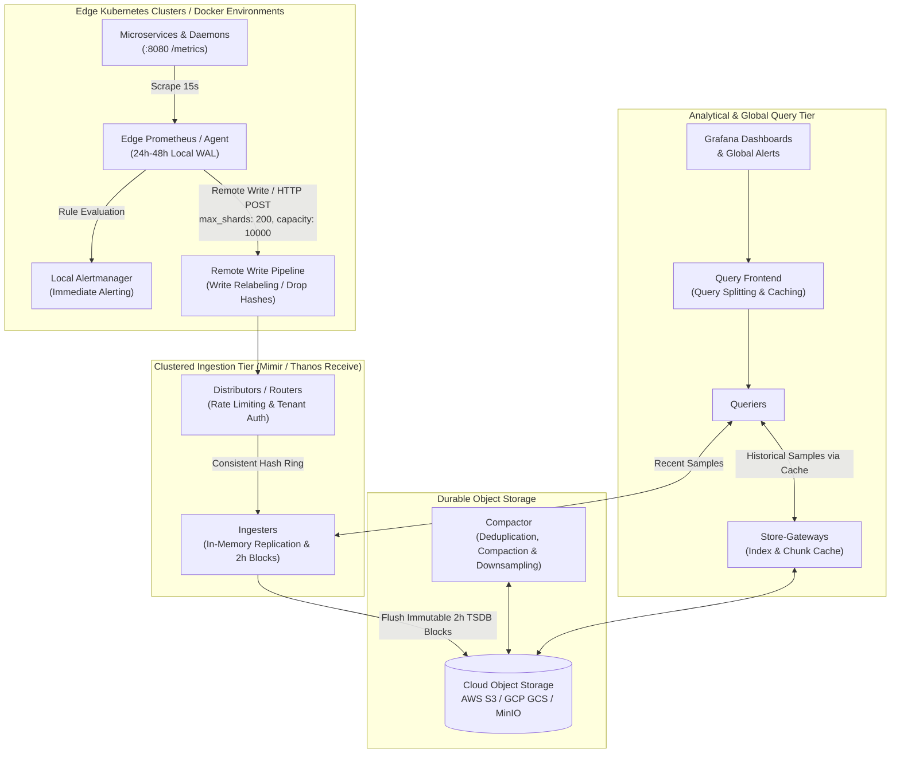
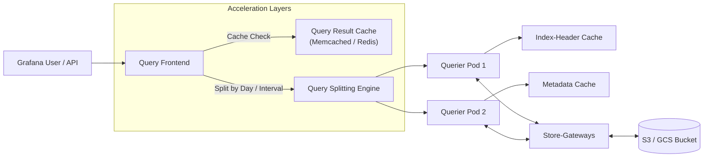
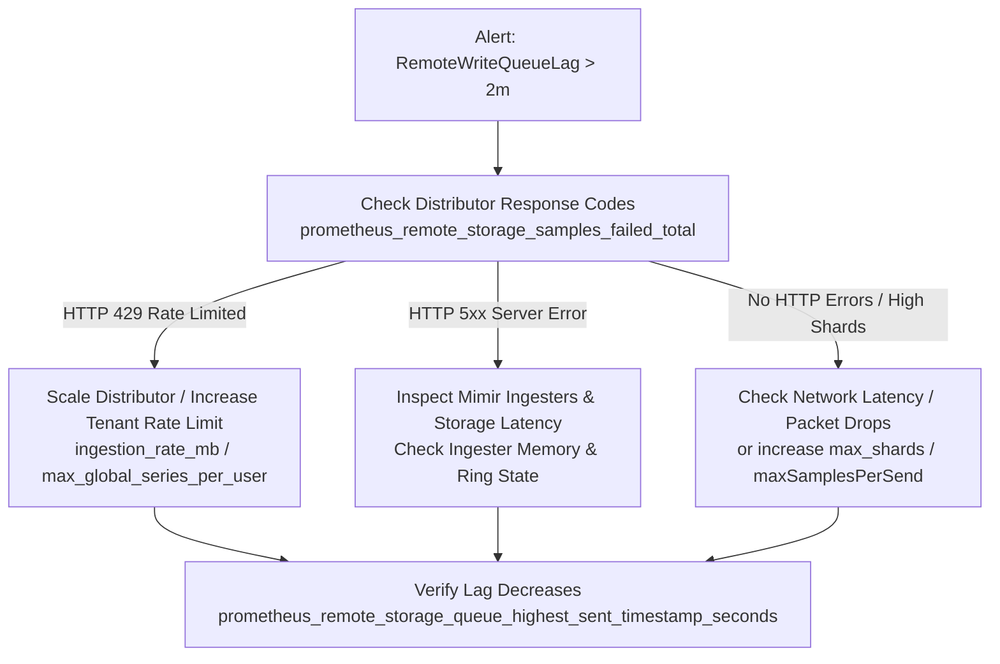

# Clustered Observability Architecture: Prometheus, Mimir & Thanos

This guide establishes the production architectural blueprint for graduating from single-node Prometheus instances to horizontally scalable, multi-tenant, clustered metrics storage backed by cloud object stores (AWS S3, GCP Cloud Storage, or MinIO). It covers the architectural trade-offs between **Thanos** and **Grafana Mimir**, details TSDB compaction, downsampling, and long-term retention policies, and provides a production SRE operational playbook for managing high-throughput remote write queues.

---

## 🎯 Architectural Overview: Single-Node TSDB vs. Clustered Storage

### The Single-Node Prometheus Ceiling

Single-node Prometheus deployments (such as standard `kube-prometheus-stack` installations) excel at local scraping and immediate alert evaluation. However, as cluster scale grows, local TSDB storage encounters physical operational boundaries:

1. **Storage & Disk IOPS Bounds**: Storing months of high-resolution metric data requires large Persistent Volumes (EBS `gp3` or GKE PD). High churn creates heavy random I/O during 2-hour TSDB block compaction, causing disk throttling.
2. **Node Recovery Latency**: When a Kubernetes node hosting Prometheus is rescheduled or upgraded, replaying a massive Write-Ahead Log (WAL) from a large local volume introduces extended downtime before scraping resumes.
3. **Absence of Native Multi-Tenancy**: Single-node Prometheus cannot enforce multi-tenant isolation, cross-team quotas, or tenant-specific retention policies.
4. **Single-Node Query Memory Ceiling**: Large multi-month queries (`rate(http_requests_total[30d])`) load hundreds of thousands of series into RAM simultaneously, triggering node OOMKills (`process_resident_memory_bytes` exhaustion).

### The Clustered Paradigm: Decoupling Ingestion from Retention

Clustered observability separates the **collection and edge alerting tier** from the **durable long-term storage and analytical query tier**:



---

## ⚖️ Technology Evaluation: Thanos vs. Grafana Mimir

Two primary production-tested architectures exist for federated, object-storage-backed Prometheus telemetry:

### 1. Thanos: The Federated / Sidecar Ecosystem

Thanos augments existing Prometheus deployments primarily through sidecar containers and specialized microservices:

* **Sidecar Architecture**: A `thanos-sidecar` container runs alongside Prometheus, shipping immutable 2-hour TSDB blocks directly to cloud object storage while serving real-time PromQL data from the local Prometheus TSDB.
* **Receive Architecture**: In environments where network policies prevent inbound queries to edge clusters, edge Prometheus instances push metrics via `remote_write` to `thanos-receive` routers and ingesters.
* **Key Advantages**: Zero migration required for existing Prometheus servers; sidecar acts transparently without modifying scraping logic; minimal infrastructure overhead for small-to-medium clusters.
* **Trade-Offs**: Query federation requires querying across every individual sidecar in real-time, which can lead to variable query latency if edge network links have high jitter.

### 2. Grafana Mimir: The Push-First Scalable Metrics Engine

Grafana Mimir is built from the ground up as a horizontally scalable, multi-tenant remote-write metrics backend:

* **Push-First Paradigm**: Edge Prometheus instances or Prometheus Agents function purely as scrapers and forward metrics via `remote_write` to Mimir Distributors.
* **Consistent Hash Ring**: Ingesters form a distributed hash ring with configurable replication factors (typically $N=3$), guaranteeing zero sample loss even during ingester pod restarts.
* **High Multi-Tenancy**: Full logical tenant isolation via the `X-Scope-OrgID` HTTP header, with per-tenant ingestion limits, query concurrency limits, and distinct retention rules.
* **Key Advantages**: Blazing fast metadata indexing, superior query-splitting across multi-month windows, and horizontal auto-scaling of stateless distributor and querier tiers.
* **Trade-Offs**: Requires running dedicated Mimir microservices (Distributor, Ingester, Querier, Store-Gateway, Compactor) and an external key-value store (etcd or Consul) for ring coordination.

### Comparison Matrix

| Architectural Dimension | Thanos (Sidecar Pattern) | Thanos (Receive Pattern) | Grafana Mimir (Remote-Write) |
|:---|:---|:---|:---|
| **Ingestion Protocol** | Pull (Prometheus local scrape) | Push (`remote_write`) | Push (`remote_write`) |
| **Object Storage Support** | S3, GCS, Azure Blob, MinIO | S3, GCS, Azure Blob, MinIO | S3, GCS, Azure Blob, MinIO |
| **Multi-Tenancy** | Soft (Header routing / Query) | Hard (`thanos-receive` tenant hashrings) | Native Hard Isolation (`X-Scope-OrgID`) |
| **Edge Prometheus Disk** | Full TSDB (retention 2h - 7d) | Stateless Agent or 24h WAL | Stateless Agent or 24h-48h WAL |
| **Query Engine** | Thanos Query + Query-Frontend | Thanos Query + Query-Frontend | Mimir Querier + Query-Frontend |
| **Downsampling Support** | Built-in (5m and 1h resolutions) | Built-in (5m and 1h resolutions) | Built-in (5m and 1h resolutions) |
| **HA Deduplication** | At Query time via replica label | At Ingester and Compactor level | At Distributor and Ingester level |
| **Best Fit** | Multi-cluster with direct network peering | Hybrid edge environments | Large-scale enterprise multi-tenant platforms |

---

## 🗄️ TSDB Lifecycle: Compaction, Downsampling & Retention Policies

### 1. TSDB Block Lifecycle

In both Mimir and Thanos, metrics follow a structured lifecycle:

1. **Head Block (Memory)**: Active samples are received and held in memory for up to 2 hours, appended to a local WAL for crash safety.
2. **2-Hour Immutable Block**: At 2-hour boundaries, in-memory chunks are cut into an immutable TSDB block containing `meta.json`, `index`, and data chunk files.
3. **Object Storage Upload**: The block is flushed to the object storage bucket with a globally unique ULID identifier.

### 2. Multi-Tier Compaction & Deduplication

Small 2-hour blocks create excessive object store metadata overhead. The **Compactor** service runs continuously in the background to optimize storage:

* **Block Merging**: Successively aggregates multiple 2-hour blocks into 12-hour, and subsequently 24-hour consolidated blocks, reducing GET/LIST API costs on the cloud bucket by up to 90%.
* **HA Deduplication**: When two Prometheus replicas scrape the same target (e.g. `prometheus-replica-0` and `prometheus-replica-1`), both write identical series. The compactor strips the `replica` label and deduplicates samples based on matching timestamps.
* **Tombstone Purging**: When series deletions or retention expirations occur, compactors physically purge deleted chunks and re-write compacted index structures.

### 3. Downsampling Strategy for High-Speed Long-Term Queries

Downsampling transforms raw sample data into aggregated statistical summaries (min, max, sum, count, and counter resets) over coarser time buckets. This prevents out-of-memory errors when querying long time ranges:

| Resolution Tier | Retention Window | Storage Footprint | Typical Query Range | Purpose |
|:---|:---|:---|:---|:---|
| **Raw Samples (15s)** | 0 to 30 Days | 100% (Baseline) | Last 1h to 7 days | Operational troubleshooting, microsecond incident analysis |
| **5-Minute Aggregation** | 30 to 180 Days | ~10% of Raw | 7 days to 90 days | Monthly SLO burn rate calculations, quarterly service reviews |
| **1-Hour Aggregation** | 180 Days to 3+ Years | ~1% of Raw | 90 days to 3 years | Annual capacity planning, historical trend analysis |

> [!TIP]
> **Query Speedup**: A 1-year query on a high-throughput counter (`http_requests_total`) across 1,000 pods at raw 15s resolution requires scanning over **2.1 billion samples**. Querying the 1-hour downsampled tier reduces the sample scan to **8.7 million samples**—a **240x reduction in memory and query execution latency**.

### 4. Cloud Object Storage Bucket Lifecycle Policies

To balance storage durability with cloud infrastructure cost, configure lifecycle rules directly on the underlying S3 or GCS bucket:

* **AWS S3 Configuration**:
  * `0 - 90 days`: S3 Standard tier.
  * `90 - 365 days`: Transition to S3 Standard-Infrequent Access (S3 Standard-IA).
  * `365+ days`: Transition to S3 Glacier Instant Retrieval (ensuring sub-second read latencies for historical queries) or expire according to compliance mandates.
* **GCP Cloud Storage Configuration**:
  * `0 - 90 days`: Standard Storage Class.
  * `90 - 365 days`: Nearline Storage Class.
  * `365+ days`: Coldline Storage Class.

---

## 🌐 Query Federation & Multi-Tier Caching

To serve queries over tens of millions of active series without query timeout failures, Mimir and Thanos employ a multi-layered caching and query acceleration hierarchy:



1. **Query Splitting by Time**: The Query Frontend intercepts wide-range queries (e.g. 30 days) and splits them into independent single-day sub-queries, dispatching them to downstream queriers in parallel.
2. **Query Result Caching**: Historical daily sub-queries are immutable. Once computed, the query result is cached in Memcached or Redis. Subsequent dashboard loads retrieve 95%+ of historical query slices directly from cache.
3. **Index-Header Caching**: Store-gateways download and cache block index headers locally on NVMe or in memory, allowing them to locate series chunks without issuing round-trip object store queries.

---

## 🛠️ SRE Operational Playbook: Edge Prometheus & Remote Write Tuning

### 1. The Prometheus Remote-Write Pipeline Architecture

Edge Prometheus reads scraped samples from its active memory segments and Write-Ahead Log, appending them into an internal in-memory sharded queue:

$$\text{Maximum Throughput (samples/sec)} = \frac{\text{max\_shards} \times \text{max\_samples\_per\_send}}{\text{batch\_send\_deadline} + \text{network\_latency}}$$

With `max_shards: 200` and `max_samples_per_send: 2000`, the theoretical peak flush capacity is:

$$\frac{200 \times 2{,}000}{0.05\text{s}} = 8{,}000{,}000\text{ samples/sec}$$

This provides massive headroom for traffic bursts and incident recovery.

### 2. Queue Configuration Reference (`mimir-remote-write.yaml`)

```yaml
queueConfig:
  maxShards: 200          # Maximum parallel HTTP worker goroutines
  minShards: 4            # Pre-warmed shards ready for immediate traffic bursts
  capacity: 10000         # Per-shard in-memory buffer limit
  maxSamplesPerSend: 2000 # Batch size to maximize HTTP throughput
  batchSendDeadline: 5s   # Flushes partial batches if traffic slows
  minBackoff: 30ms        # Initial retry backoff on HTTP 429 / 5xx
  maxBackoff: 5s          # Upper bound on retry backoff
  retryOnRateLimit: true  # Prevents dropped samples on distributor rate limit
```

### 3. Handling Rate Spikes & Write-Queue Lag

When upstream microservices experience sudden traffic surges or distributor pods undergo rolling updates, write queue lag may develop.

#### Key Health Indicators

Monitor the following core Prometheus metrics:

* **Lag in Seconds**:
  ```promql
  time() - prometheus_remote_storage_queue_highest_sent_timestamp_seconds{remote_name="mimir-distributor"}
  ```
  * *Healthy*: $< 30\text{s}$.
  * *Warning*: $> 120\text{s}$.
  * *Critical*: $> 600\text{s}$ (approaching WAL segment retention window).

* **Active Shards Saturation**:
  ```promql
  prometheus_remote_storage_shards{remote_name="mimir-distributor"}
  ```
  If shards reach `max_shards` (200), the remote write queue is saturated and cannot scale out further.

* **Sample Failure and Drop Rates**:
  ```promql
  rate(prometheus_remote_storage_samples_failed_total[5m])
  rate(prometheus_remote_storage_samples_dropped_total[5m])
  rate(prometheus_remote_storage_samples_retried_total[5m])
  ```

#### Step-by-Step Lag Remediation Workflow



1. **Verify Upstream Status**: Check whether the distributor is returning HTTP 429 (Too Many Requests) or HTTP 500 (Internal Server Error):
   ```bash
   kubectl logs -n monitoring -l app.kubernetes.io/name=prometheus -c prometheus --tail=100 | grep "remote_write"
   ```
2. **If HTTP 429 Occurs**: The tenant ingestion rate limit has been exceeded. Temporarily raise the limits on Mimir distributors (`-distributor.ingestion-rate-mb=100`) or adjust the tenant overrides in Mimir runtime configuration.
3. **If HTTP 5xx Occurs**: Check whether Mimir ingesters are undergoing garbage collection pauses or storage disk latency spikes. Ingesters will reject writes if their WAL disks are full.

### 4. Memory Pressure & Preventing OOMKills

Each remote write shard maintains an in-memory queue buffer governed by `capacity`.

#### Memory Footprint Estimation

$$\text{Buffer Memory} = \text{max\_shards} \times \text{capacity} \times \text{Sample Memory}$$

For $200\text{ shards} \times 10{,}000\text{ capacity} = 2{,}000{,}000\text{ samples}$. At approximately 16 bytes per raw sample plus Go runtime pointer overhead (~40 bytes total), the queued sample buffer consumes **~80MB to 160MB of RAM**.

However, snappy/protobuf compression buffers and connection pooling can elevate this during peak bursts. Ensure the Prometheus container has adequate headroom:

```yaml
resources:
  requests:
    cpu: 1000m
    memory: 4Gi
  limits:
    cpu: 4000m
    memory: 16Gi
```

### 5. Metric Relabeling: Guarding Against High-Cardinality Series Explosions

High cardinality (such as unique UUIDs, randomized URLs, or ephemeral container hashes) degrades object storage index performance and drives up cloud costs.

The `writeRelabelConfigs` in `deploy/kubernetes/overlays/mimir-remote-write.yaml` provide front-line defense:

```yaml
writeRelabelConfigs:
  # 1. Strip Kubernetes rolling deployment hashes
  - action: labeldrop
    regex: "(pod_template_hash|controller_revision_hash|pod_template_generation)"

  # 2. Strip container runtime and transient metadata
  - action: labeldrop
    regex: "(container_id|image_id|uid|endpoint)"

  # 3. Strip build system annotations
  - action: labeldrop
    regex: "(chart|heritage|app_kubernetes_io_managed_by)"

  # 4. Strip accidental client-side high-cardinality tags
  - action: labeldrop
    regex: "(client_ip|request_id|trace_id|span_id)"

  # 5. Inject multi-cluster routing label
  - targetLabel: cluster
    replacement: "cno-k8s-prod"
    action: replace
```

#### Auditing High-Cardinality Labels at Runtime

Identify series explosions before they pollute long-term storage:

```bash
# Query top 10 highest cardinality metric names
curl -s http://localhost:9090/api/v1/status/tsdb | jq '.data.seriesCountByMetricName[0:10]'

# Query top 10 highest cardinality label names
curl -s http://localhost:9090/api/v1/status/tsdb | jq '.data.labelValueCountByLabelName[0:10]'
```

---

## 🚀 Step-by-Step Deployment Verification

### 1. Apply Kubernetes Remote-Write Overlay

```bash
helm upgrade --install kube-prometheus-stack prometheus-community/kube-prometheus-stack \
  --namespace monitoring \
  -f deploy/kubernetes/helm/kube-prometheus-stack/values-base.yaml \
  -f deploy/kubernetes/overlays/mimir-remote-write.yaml
```

### 2. Verify Remote Write Ingestion at Runtime

Check that Prometheus successfully communicates with the remote write endpoint:

```bash
# Verify remote write status
kubectl exec -n monitoring prometheus-kube-prometheus-stack-prometheus-0 -c prometheus -- \
  wget -qO- http://localhost:9090/api/v1/status/config | grep -A 25 "remote_write"

# Confirm zero persistent dropped samples
kubectl exec -n monitoring prometheus-kube-prometheus-stack-prometheus-0 -c prometheus -- \
  wget -qO- http://localhost:9090/metrics | grep "prometheus_remote_storage_samples_total"
```

---

## 📚 Related Documentation

* [Architecture Overview](../ARCHITECTURE.md)
* [Service Level Objectives & Alerting Design](SLO_DESIGN.md)
* [OpenTelemetry Sampling Strategies](SAMPLING_STRATEGIES.md)
* [Production Incident Runbooks](RUNBOOKS.md)
* [Cloud Infrastructure & Terraform Guide](TERRAFORM_GUIDE.md)
