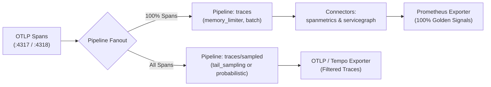

# OpenTelemetry Sampling Strategies Guide

In high-throughput microservice architectures, capturing 100% of all traces can create excessive backend storage pressure and network transfer costs. This guide details the **trace sampling architectures** supported by the OpenTelemetry Collector, distinguishes **in-cluster working configurations** from **cloud-specific sampling overlays**, and explains how to protect metric accuracy while sampling.

---

## 🎯 Comparison Matrix

| Strategy | Decision Point | Overhead | 100% Error Retention | Metric Accuracy | Best For |
|:---|:---|:---|:---|:---|:---|
| **Probabilistic Head Sampling** | Ingestion start ($t=0$) | Lowest (negligible CPU/RAM) | ❌ No (errors randomly sampled out) | 100% via dual-pipeline | Routine, high-volume APIs where statistical sampling is sufficient |
| **Tail-Based Multi-Rule Sampling** | Trace completion ($t = \text{end}$) | Medium (buffers traces in memory) | ✅ Yes (100% of errors & slow calls retained) | 100% via dual-pipeline | Mission-critical production services, SLAs, and troubleshooting |
| **Cloud APM Overlays** | Collector export | Dependent on cloud exporter | Configured via cloud sampling rules | Cloud APM dependent | AWS X-Ray, GCP Cloud Trace, or hybrid multi-cloud telemetry |

---

## 📐 The Dual-Pipeline Architecture (Protecting Golden Signals)

In this platform, the OpenTelemetry Collector runs connectors (`spanmetrics` and `servicegraph`) to generate RED metrics (rate, error, duration) and dependency topology directly from traces into Prometheus.

If sampling were applied before connectors, request counts and error rates would be artificially truncated. To resolve this, all in-cluster sampling configurations adopt a **dual-pipeline design**:



1. **`traces` pipeline**: Receives 100% of spans and routes them directly to `spanmetrics` and `servicegraph` connectors. Prometheus receives untruncated Golden Signals.
2. **`traces/sampled` pipeline**: Applies sampling policies (tail-based rules or probabilistic filtering) and transmits only retained traces to Tempo for storage.

---

## 🛠️ Working In-Cluster Deployments

Ready-to-use Helm value overlays are provided in the collector Helm directory:

### Option A: Tail-Based Multi-Rule Sampling (Recommended)

Keeps 100% of HTTP 5xx / gRPC errors, 100% of calls exceeding 500ms, 100% of critical transactional routes (`/api/v1/checkout`, `/api/v1/payments`), and a 5% baseline of routine traffic.

```bash
helm upgrade --install otel-collector open-telemetry/opentelemetry-collector \
  --namespace opentelemetry \
  -f deploy/kubernetes/helm/otel-collector/values.yaml \
  -f deploy/kubernetes/helm/otel-collector/values-sampling-tail.yaml
```

### Option B: Probabilistic Head-Based Sampling

Applies uniform 10% sampling to trace storage while preserving 100% metric calculations:

```bash
helm upgrade --install otel-collector open-telemetry/opentelemetry-collector \
  --namespace opentelemetry \
  -f deploy/kubernetes/helm/otel-collector/values.yaml \
  -f deploy/kubernetes/helm/otel-collector/values-sampling-probabilistic.yaml
```

---

## ☁️ Cloud-Specific Sampling Overlays & Topology Considerations

When operating in managed cloud environments (AWS, GCP) or scaling across large multi-node clusters, consider the following architectural factors:

### 1. Multi-Node DaemonSet Limitation & 2-Tier Collector Topology

In the default configuration, the OpenTelemetry Collector runs as a **DaemonSet** (one pod per Kubernetes node).
- **The Challenge**: A tail sampler on Node A only inspects spans sent to Node A. If a distributed trace spans microservices on Node A and Node B, each node's collector only has partial trace visibility. If Node B records a 500 error, Node A's collector may discard its upstream spans if evaluating in isolation.
- **The Solution (2-Tier Architecture)**:
  1. **Agent Layer (DaemonSet)**: Collects node-local spans and uses the OpenTelemetry Collector `loadbalancing` exporter configured with `routing_key: "trace_id"`. This ensures all spans sharing the same `trace_id` are routed to the same gateway instance regardless of origin node.
  2. **Gateway Layer (Deployment)**: A horizontally scaled deployment with autoscaling (HPA) that performs centralized `tail_sampling` before exporting to Tempo or cloud storage.

### 2. Cloud Exporter Overlays

If routing traces directly to cloud provider tracing services instead of or in addition to Tempo:

- **AWS EKS / AWS X-Ray**:
  Requires configuring the `awsxray` exporter in the pipeline and attaching an IAM role via IRSA to the collector service account:
  ```yaml
  serviceAccount:
    annotations:
      eks.amazonaws.com/role-arn: arn:aws:iam::<ACCOUNT_ID>:role/otel-collector-xray
  ```
- **GCP GKE / Google Cloud Trace**:
  Requires configuring the `googlecloud` exporter with Workload Identity binding `roles/cloudtrace.agent` on the Google Service Account:
  ```yaml
  serviceAccount:
    annotations:
      iam.gke.io/gcp-service-account: otel-sa@<PROJECT_ID>.iam.gserviceaccount.com
  ```

Templates for these cloud exporter pipelines are documented in [`sampling-strategies.yaml`](../deploy/kubernetes/helm/otel-collector/sampling-strategies.yaml).

---

## 💾 Memory Budgeting for Tail-Based Sampling

Tail-based sampling buffers traces in memory during the `decision_wait` window. Use this formula to size collector memory requests and limits:

$$\text{Memory Buffer} = \text{Traces/sec} \times \text{Average Trace Size} \times \text{decision\_wait} \times \text{Safety Factor (1.5)}$$

*Example*: For 2,000 traces/sec with an average trace size of 10 KB and `decision_wait: 10s`:
$$2,000 \times 10\,\text{KB} \times 10\,\text{s} \times 1.5 \approx 300\,\text{MB}$$

The overlay [`values-sampling-tail.yaml`](../deploy/kubernetes/helm/otel-collector/values-sampling-tail.yaml) configures 1 GiB memory request and 4 GiB limit to accommodate burst traffic comfortably.
